# SHIELD-COM — Inline Voice-Cleaning & Audio Intelligence Module

> An interactive 3D engineering viewer for **SHIELD-COM**, a concept inline audio-intelligence
> module that sits on the accessory audio path of a field radio — cleaning voice, managing
> levels, buffering short clips and tagging events, with **no RF of its own**.

Built with **React 19 · Vite 7 · TypeScript · Tailwind CSS 4 · Three.js (React Three Fiber)**.
The whole site compiles down to a **single self-contained HTML file** via `vite-plugin-singlefile`.

---

## ✦ What this is

This repository is *not* firmware or CAD — it is a **web-based engineering explainer**: a fully
procedural 3D model of the product (enclosure, 4-layer PCB, battery, shields, host radio), wired
to a live device-state store, a scripted field demo, and a WebAudio engine that demonstrates the
*raw radio vs. SHIELD-COM processed* audio path with real voiced tactical transmissions.

Highlights:

- 🧊 **Interactive 3D viewer** — 45 procedural parts, 4 view modes, per-system isolation, part focus, labels & dimensions
- 📻 **Working virtual host radio** — walkie-talkie with LCD menus, VFO/MR, scan, PTT, torch, alarm — all live
- 🎚️ **Audio engine** — squelch bursts, pink-noise RF carrier, crackle pops, roger beeps, and 5 selectable voice transmissions, switchable between *raw* and *processed* feeds
- 🎬 **Scripted field demo** — a 10-step operator scenario driving the *same* store the 3D model reads
- 📊 **Live visualisations** — oscilloscope, spectrum bars, VU meter, raw-vs-clean comparison waves
- 📐 **Engineering content** — system cards, power rails, interfaces, materials, service plan, and an honesty section splitting *measured* vs *design target* vs *planned validation*

---

## 🚀 Quick start

```bash
npm install     # install dependencies
npm run dev     # start the dev server  → http://localhost:5173
```

Production build (emits **one** HTML file with everything inlined):

```bash
npm run build   # → dist/index.html  (fully self-contained, works offline)
npm run preview # serve the production build locally
```

| Script          | What it does                                        |
| --------------- | --------------------------------------------------- |
| `npm run dev`   | Vite dev server with HMR on port 5173               |
| `npm run build` | Single-file production build to `dist/index.html`   |
| `npm run preview` | Serves the built file for a final check           |

> **Note:** the audio engine needs a user gesture before it can start (browser autoplay
> policy) — click any transmission chip or the demo deck first.

---

## 🧰 Tech stack

| Layer        | Choice                                                              |
| ------------ | ------------------------------------------------------------------- |
| UI           | React 19, TypeScript, Tailwind CSS 4 (`@tailwindcss/vite`)          |
| 3D           | Three.js, `@react-three/fiber` 9, `@react-three/drei` 10            |
| State        | Hand-rolled external stores via `useSyncExternalStore` (no Redux)   |
| Audio        | Raw WebAudio API — procedural noise, filters, speech, tones         |
| Textures     | Procedural `CanvasTexture`s (PCB silkscreen, brushed metal, braid)  |
| Build        | Vite 7 + `vite-plugin-singlefile` → one `.html` artefact            |
| Styling util | `clsx` + `tailwind-merge`                                           |

---

## 🗂️ Project structure

```
shield-com/
├── index.html                  # entry, SEO/meta
├── vite.config.ts              # react + tailwind + singlefile, "@" alias
├── package.json
├── tsconfig.json
└── src/
    ├── main.tsx                # React bootstrap
    ├── App.tsx                 # page assembly (all sections)
    ├── index.css               # Tailwind + graphite/cyan/amber design tokens
    ├── assets/                 # hero-studio.jpg, field-use.jpg
    ├── components/
    │   ├── Viewer.tsx          # 3D canvas, mode toolbar, comms bar, HUD
    │   ├── Demo.tsx            # 2D interactive demo deck (mirrors the 3D)
    │   ├── Sections.tsx        # Nav/Hero/Overview/Architecture/PcbSystems/…
    │   ├── Diagrams.tsx        # SVG diagrams (overview, signal, power)
    │   └── Waveforms.tsx       # canvas scopes, spectrum, VU (audio-reactive)
    ├── three/
    │   ├── ShieldCom.tsx       # the full procedural 3D product model (~72 kB)
    │   ├── pcb.ts              # board geometry, footprints, canvas textures
    │   ├── device.ts           # live device store: radio + SHIELD-COM + LEDs
    │   ├── demo.ts             # 10-step scripted operator scenario
    │   ├── audio.ts            # tactical radio audio engine (WebAudio)
    │   └── state.ts            # viewer context: mode, isolate, selection
    ├── data/
    │   ├── parts.ts            # 45 PartDefs: systems, positions, explode maps
    │   └── content.ts          # cards, tables, claims, field copy
    └── utils/
        └── cn.ts               # clsx + tailwind-merge helper
```

---

## 🧭 Architecture

### High-level application flow

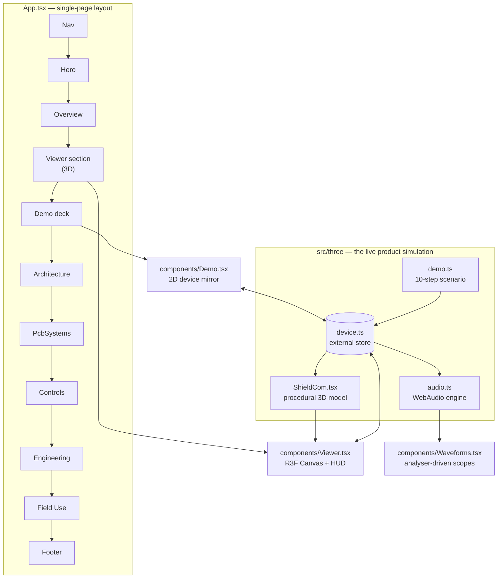

### One store, three faces

The heart of the app is a single hand-rolled store (`three/device.ts`, read with
`useSyncExternalStore`). The **3D model**, the **2D demo deck** and the **scripted demo** all
write to and read from it — press a button anywhere and everything reacts at once.

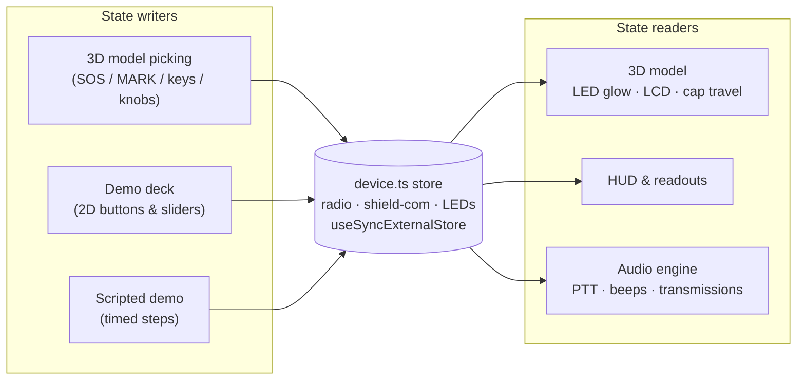

### Viewer modes

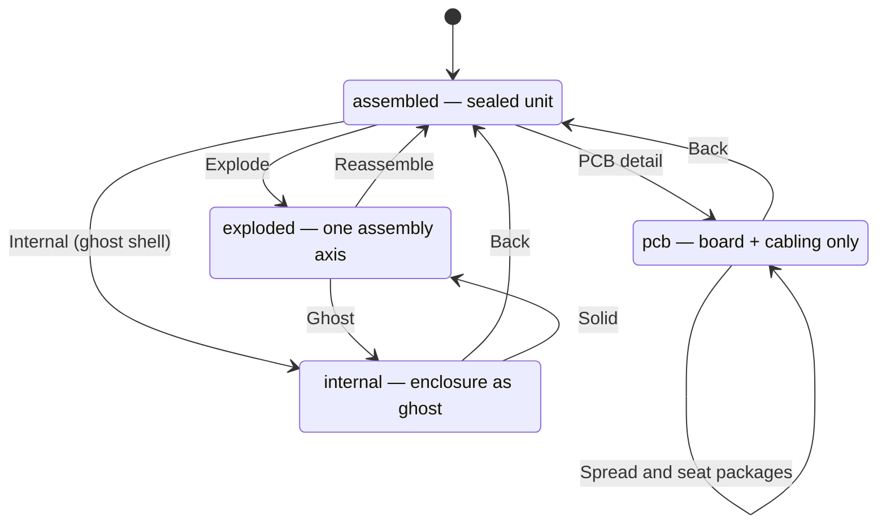

State available in every mode (`three/state.ts` → `ViewerCtx`):

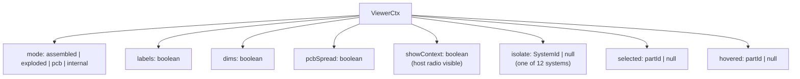

---

## 🔊 The product's signal chain (as modelled)

What the 3D model and the diagrams teach — the electronics story of the device itself:

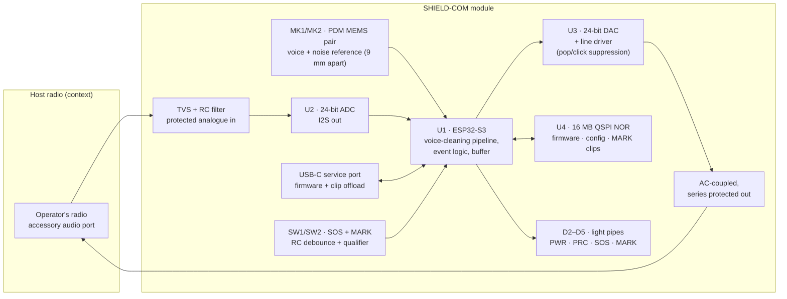

### Power tree

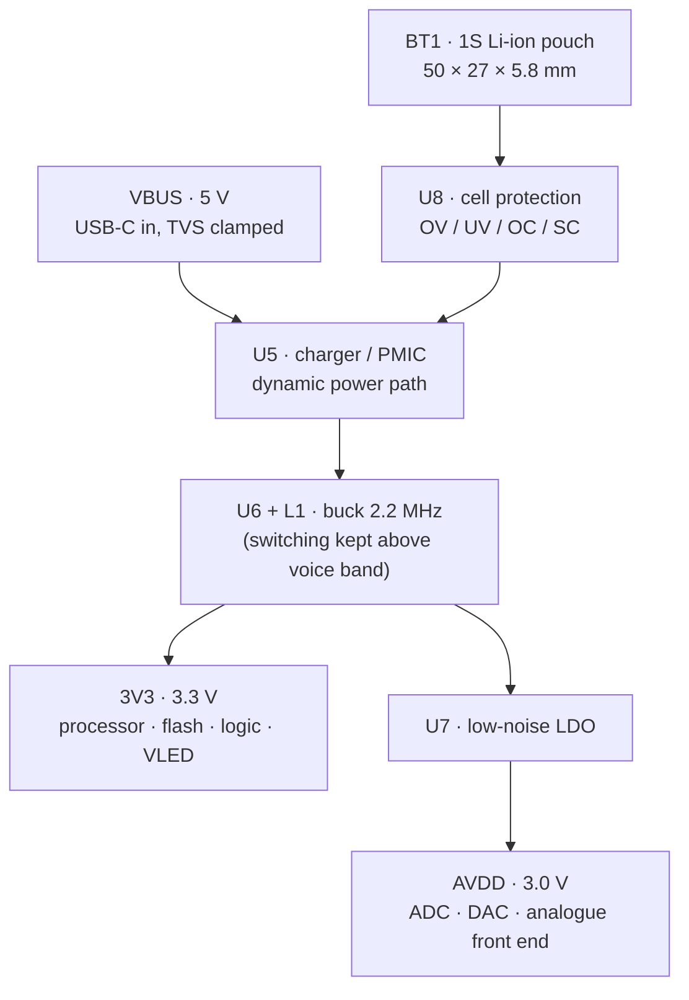

---

## 🎧 The app's audio engine

`three/audio.ts` synthesises everything live in WebAudio — there are no audio files.
A transmission is a sequence of scheduled nodes:

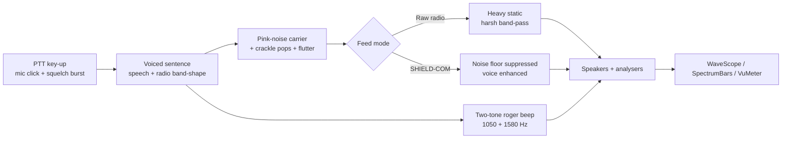

Available transmissions (`RADIO_SENTENCES`, 5 total) include a SITREP, a rotor-noise filter
check and more — each on its own VHF/UHF channel notice.

---

## 🎬 Scripted field demo

`three/demo.ts` plays a 10-step operator scenario through the same store, framing the camera on
the relevant part at each step:

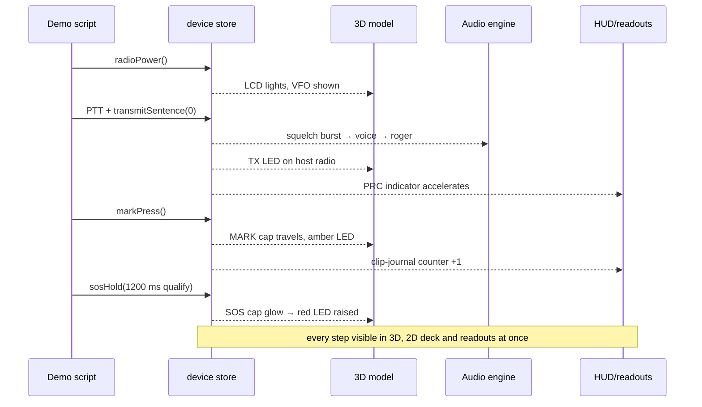

---

## 🧱 Data model

Everything the 3D viewer knows about a part comes from `data/parts.ts` — position, assembly
behaviour, labelling and the engineering copy shown on selection:

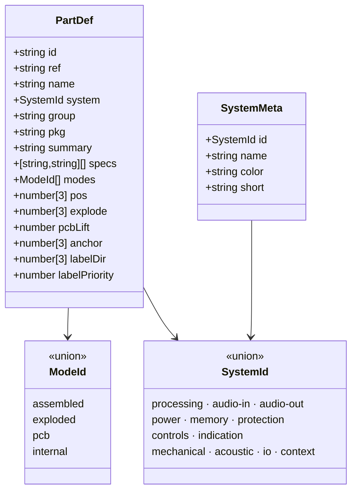

The 12 colour-coded systems:

| System      | Contents (examples)                          | Colour  |
| ----------- | -------------------------------------------- | ------- |
| processing  | U1 ESP32-S3 module                           | cyan    |
| audio-in    | U2 ADC, input protection/filter island       | blue    |
| audio-out   | U3 DAC + line driver                         | olive   |
| power       | BT1 cell, U5–U7, rails                       | amber   |
| memory      | U4 16 MB QSPI NOR                            | purple  |
| protection  | D1 TVS, U8 cell cut-off, EMI cans            | red     |
| controls    | SW1 SOS, SW2 MARK sealed switches            | coral   |
| indication  | D2–D5 LEDs + light pipes                     | green   |
| mechanical  | enclosure, frame, gasket, fasteners          | grey    |
| acoustic    | MEMS pair, ePTFE membrane, ducts             | teal    |
| io          | USB-C, audio harnesses, cell connector       | gold    |
| context     | host radio + cabling                         | slate   |

---

## ⚙️ Engineering content modelled in the viewer

Power rails, interfaces and key components come from `data/content.ts`:

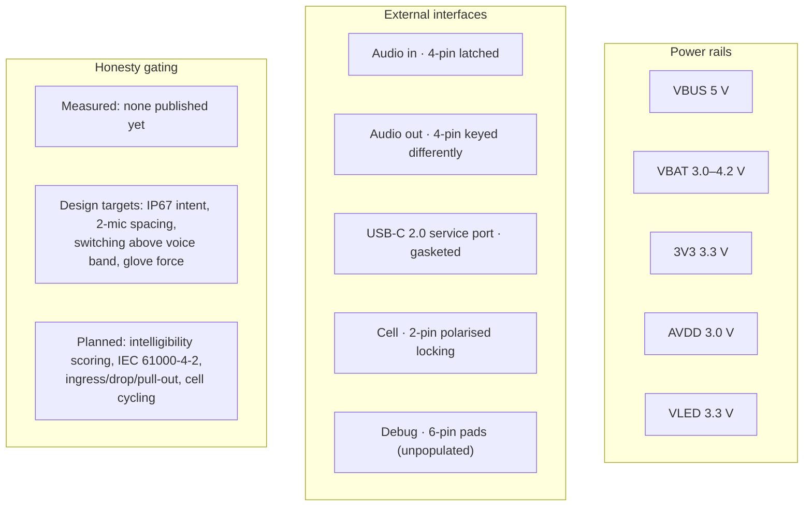

Key components: **U1** ESP32-S3 SoM · **U2** 24-bit ADC (QFN-16) · **U3** DAC + driver
(QFN-20) · **U4** QSPI NOR (SOIC-8) · **U5** charger/PMIC · **U6** 2.2 MHz buck · **U7**
low-noise LDO · **U8** cell protection · **D1** TVS array · **MK1/MK2** PDM MEMS mics ·
**SW1/SW2** sealed tactiles · **BT1** 1S pouch cell.

---

## 🏗️ Build pipeline

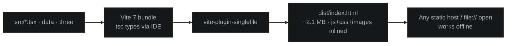

Because the output is one file, deployment is: copy `dist/index.html` anywhere — GitHub Pages,
S3, an email attachment, or double-click it locally.

---

## 📄 Content sections of the page

1. **Hero** — hero-studio render, one-line product thesis
2. **Overview** — the 8-point story (intelligibility first, *inline not instead*, no RF…)
3. **Viewer** — the interactive 3D module with the four modes and comms bar
4. **Demo** — glove-sized 2D deck + scripted scenario runner
5. **Architecture** — signal-chain diagram and system cards (01–08)
6. **PCB systems** — per-subsystem deep dives tied to 3D part IDs
7. **Controls** — SOS long-press + MARK semantics, LED language
8. **Engineering** — components, interfaces, rails, materials, service plan, claims
9. **Field use** — the six field behaviours that shaped the design
10. **Footer** — colophon and disclaimers

---

## ⚠️ Disclaimers

- SHIELD-COM is a **concept/engineering communication piece**; performance figures are labelled
  as *design target* or *planned validation* where no measurements exist — see the claims
  section in-app.
- The host radio, its menus and procedures are a **generic fictional walkie-talkie** built for
  the demo, not a clone of any specific product.
- Audio playback requires a user gesture (browser policy) and WebAudio support.

---

## 📝 License

No license file is included yet. Add one before distributing beyond private use.
